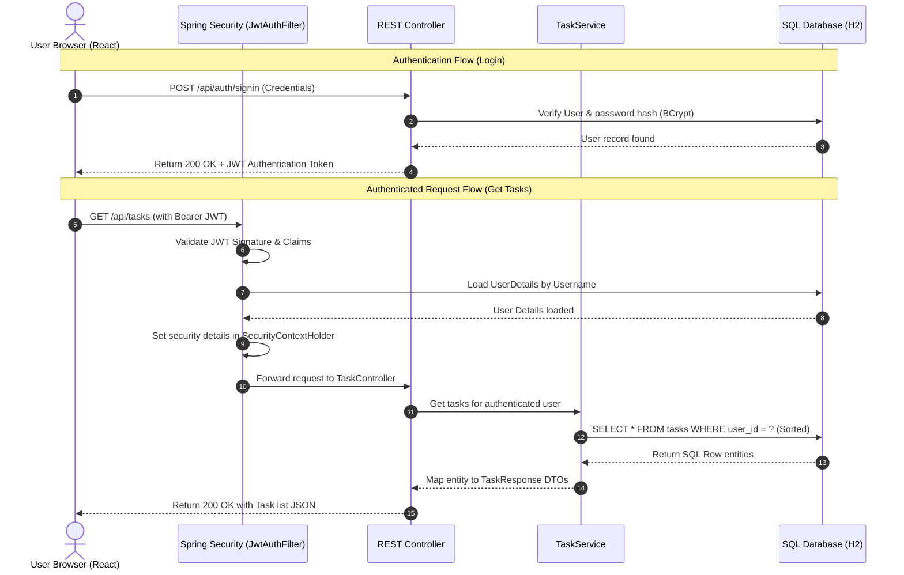

# TaskFlow ⚡ — Full-Stack Task Manager (REST API & React SPA)

TaskFlow is a premium, secure, and responsive Task Management web application. By integrating a robust **Spring Boot 3 REST API** backend with a modern **React + Vite** frontend, TaskFlow establishes a clean, high-performance solution for everyday personal productivity.

---

## 📋 Table of Contents
1. [The Problem Statement](#-the-problem-statement)
2. [Ideation & Product Goals](#-ideation--product-goals)
3. [Architecture & Workflow](#-architecture--workflow)
4. [Technology Stack](#%EF%B8%8F-technology-stack)
5. [API Endpoint Reference](#-api-endpoint-reference)
6. [Local Installation & Setup](#-local-installation--setup)
7. [End-to-End Verification Flow](#-end-to-end-verification-flow)

---

## 🔍 The Problem Statement

In the modern digital landscape, productivity tracking apps are often either over-engineered (cluttered with complex enterprise structures) or under-engineered (lacking basic data protection, user authorization, or fluid responsive layouts). 

Key challenges users face include:
* **Visual Friction**: Cluttered interfaces with generic styling that drain user motivation.
* **Security & Isolation Risks**: Lack of data isolation, meaning users' personal or professional tasks can be accessed or modified by other accounts.
* **Complex Lifecycles**: Overly complex status changes that slow down the quick daily checklist workflow.
* **High Setup Overhead**: Local databases requiring complex server setups and environment configurations just to test a simple demonstration.

---

## 💡 Ideation & Product Goals

TaskFlow was ideated to bridge the gap between **enterprise-grade security** and a **frictionless, beautifully styled client workspace**:

1. **Strict Zero-Trust Isolation**: Users must have private spaces. Authentication is enforced statelessly using **JSON Web Tokens (JWT)**.
2. **"Minimal yet Vibrant" Visual Design**: Avoid heavy layouts. Implement a dark theme with **frosted glass (glassmorphism)** and glowing status borders that draw focus to immediate priorities.
3. **Frictionless Task Lifecycle**: One-click status cycling (`TO DO` ➡️ `IN PROGRESS` ➡️ `COMPLETED`) to keep active checklists quick and interactive.
4. **Instant Spin-up**: Zero-configuration deployment by utilizing an **in-memory SQL database (H2)** that sets up schema relations on application start.

---

## 🏗️ Architecture & Workflow

TaskFlow follows a decoupled client-server architecture. Below is the secure workflow representing user registration, request authentication, and database transaction queries:



---

## 🛠️ Technology Stack

### Backend Services
* **Language & Runtime**: **Java 23** & **Spring Boot 3.4.1**
* **Access Control**: **Spring Security 6** (BCrypt Password Encoder, CORS configuration, and stateless HTTP filter chains)
* **Token Utility**: **JJWT (io.jsonwebtoken version 0.12.6)** for secure cryptographic signing and validation of JSON Web Tokens.
* **Database Driver**: **Spring Data JPA & Hibernate** for object-relational mapping.
* **Data Store**: **H2 Database (In-Memory)** for lightweight, fast SQL transactions with zero local database installation overhead.

### Frontend Client
* **Framework**: **React** (v18+) bootstrapped with **Vite** (for blazing-fast Hot Module Replacement).
* **Styling**: **Vanilla CSS** utilizing custom properties (CSS variables), glassmorphism styles (`backdrop-filter`), keyframe animations, and scrollbar customizations.
* **Icons**: **Lucide React** for clean, modern, and lightweight vector graphics.
* **API Bridge**: Native **fetch** client wrapper with request headers automatically injecting JWT tokens from browser storage.

---

## 🔌 API Endpoint Reference

### 1. Authentication (`/api/auth`)
* **`POST /api/auth/signup`**: Create a new account.
  * **Payload**: `{"username": "johndoe", "email": "john@example.com", "password": "password123"}`
  * **Response**: `{"message": "User registered successfully!"}`
* **`POST /api/auth/signin`**: Authenticate and retrieve token.
  * **Payload**: `{"username": "johndoe", "password": "password123"}`
  * **Response**: `{"token": "eyJhbGciOi...", "id": 1, "username": "johndoe", "email": "john@example.com"}`

### 2. Task Management (`/api/tasks`) — *Requires `Authorization: Bearer <token>`*
* **`GET /api/tasks?sortBy=deadline&sortOrder=asc`**: Retrieve tasks owned by the logged-in user, dynamically sorted.
  * **Response**: `[{"id": 1, "title": "Buy groceries", "description": "Milk, eggs, flour", "status": "TODO", "priority": "MEDIUM", "deadline": "2026-05-27", "userId": 1}]`
* **`POST /api/tasks`**: Create a new task.
  * **Payload**: `{"title": "Complete README", "description": "Add architecture flow", "status": "TODO", "priority": "HIGH", "deadline": "2026-05-26"}`
* **`PUT /api/tasks/{id}`**: Modify task details.
* **`DELETE /api/tasks/{id}`**: Permanently remove a task.
* **`PATCH /api/tasks/{id}/status?status={status}`**: Quick-cycle task status (`TODO`, `IN_PROGRESS`, `COMPLETED`).

---

## 🚀 Local Installation & Setup

### Prerequisites
* **Java SDK 23** installed and in your environment PATH.
* **Node.js** (v18+) and **npm** installed.

---

### Step 1: Run the Backend Server
From the project root folder:
1. Compile the code and start the embedded Tomcat server:
   ```powershell
   .\gradlew bootRun
   ```
2. The server will spin up on **[http://localhost:8081](http://localhost:8081)**.
3. You can browse database tables via the integrated **H2 Web Console** at **[http://localhost:8081/h2-console](http://localhost:8081/h2-console)** using:
   * **JDBC URL**: `jdbc:h2:mem:taskdb`
   * **User Name**: `sa`
   * **Password**: `password`

---

### Step 2: Spin up the React Client
Open a second terminal window and navigate to the `frontend/` directory:
1. Install dependencies:
   ```powershell
   npm install
   ```
2. Launch the developer server:
   ```powershell
   npm run dev
   ```
3. Open your browser and navigate to **[http://localhost:5173](http://localhost:5173)** to start using TaskFlow!

---

## 🧪 End-to-End Verification Flow

To verify the app is fully operational, perform these steps in your browser:
1. **Create Account**: Go to `http://localhost:5173` ➡️ Click **Create Account** ➡️ Register a new user.
2. **Log In**: Log in using your registered credentials. The browser receives your unique JWT and loads the personal dashboard workspace.
3. **Workspace Tracking**: Observe the **Stats Row** displaying dynamic completion percentages and priority alerts based on your task count.
4. **CRUD Actions**: Create a task with `HIGH` priority and a deadline. Verify the stats cards update instantly. Edit the task to change its priority or description, and click the cycle button to set it to `IN PROGRESS` or `COMPLETED`.
5. **Session & Security Validation**: 
   * Click **Sign Out**. 
   * Register a *second* user account and log in.
   * Verify that the second user's dashboard is completely clean, demonstrating that tasks are securely locked and isolated for each user account.
